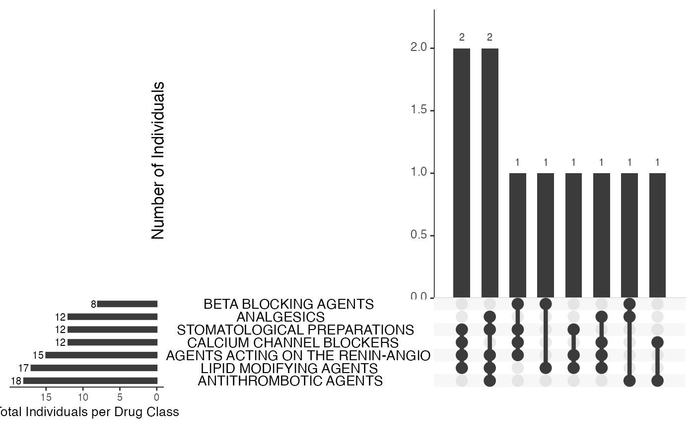
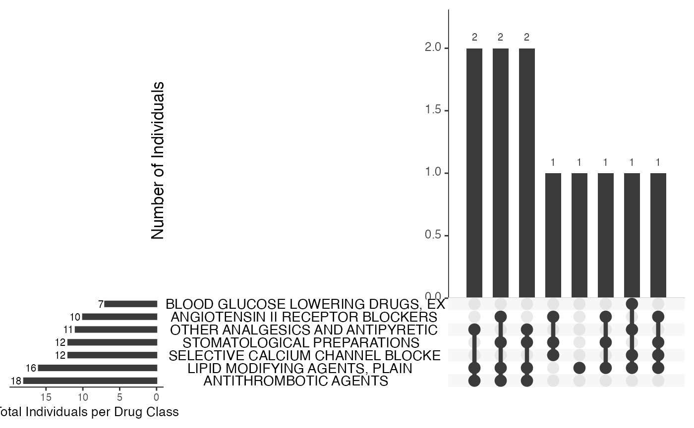

<div id="main" class="col-md-9" role="main">

# rxclassR: use the NIH rxclass API for drug classification

<div class="section level2">

## Introduction

We will use the API at `https://rxnav.nlm.nih.gov/REST/rxclass` as
defined in early 2026 to simplify classification of drugs.

We will assume that an `rxcui` identifier is available for any drug of
interest.

This package is not designed to do large scale interrogation of the API,
which might lead to banning the host IP address for overuse. Any loops
should include sleep directives.

</div>

<div class="section level2">

## Obtaining classification codes

The endpoint `rxclass/class/byRxcui` is very inclusive and will return
information on multiple related compounds. The `filter` argument forces
focus on the compound rxcui supplied.

<div id="cb1" class="sourceCode">

``` r
library(rxclassR)
getclass(1364447, filter=TRUE)
```

</div>

    ## $input
    ## [1] 1364447
    ## 
    ## $name
    ## [1] "apixaban 5 MG Oral Tablet [Eliquis]"
    ## 
    ## $classinfo
    ##      rxcui classtype                   classname classid
    ## 3  1364430    ATC1-4 Direct factor Xa inhibitors   B01AF
    ## 20 1364445    ATC1-4 Direct factor Xa inhibitors   B01AF
    ## 22 1364447    ATC1-4 Direct factor Xa inhibitors   B01AF
    ## 24 1992427    ATC1-4 Direct factor Xa inhibitors   B01AF
    ## 26 1992428    ATC1-4 Direct factor Xa inhibitors   B01AF
    ## 
    ## $paths
    ## $paths[[1]]
    ##   classId                       className classType
    ## 1   B01AF     Direct factor Xa inhibitors    ATC1-4
    ## 2    B01A           ANTITHROMBOTIC AGENTS    ATC1-4
    ## 3     B01           ANTITHROMBOTIC AGENTS    ATC1-4
    ## 4       B  BLOOD AND BLOOD FORMING ORGANS    ATC1-4
    ## 5       0 Anatomical Therapeutic Chemical    ATC1-4

</div>

<div class="section level2">

## Learning about the hierarchy of a given class

Here we assume the argument is a potential class code known to the
rxclass API.

<div id="cb3" class="sourceCode">

``` r
getpath("B01AF")
```

</div>

    ##   classId                       className classType
    ## 1   B01AF     Direct factor Xa inhibitors    ATC1-4
    ## 2    B01A           ANTITHROMBOTIC AGENTS    ATC1-4
    ## 3     B01           ANTITHROMBOTIC AGENTS    ATC1-4
    ## 4       B  BLOOD AND BLOOD FORMING ORGANS    ATC1-4
    ## 5       0 Anatomical Therapeutic Chemical    ATC1-4

</div>

<div class="section level2">

## Configurations of treatments

The `make_upset` function shows the most common classes and combinations
seen in the cohort.

<div id="cb5" class="sourceCode">

``` r
suppressWarnings(example(make_upset, ask=FALSE))
```

</div>

    ## 
    ## mk_pst> data(allcls)
    ## 
    ## mk_pst> thes = lapply(allcls, summ, 3)
    ## 
    ## mk_pst> for (i in seq_len(length(allcls))) thes[[i]]$id = i
    ## 
    ## mk_pst> ddf = do.call(rbind, thes)
    ## 
    ## mk_pst> make_upset(ddf)



Note that the diagram depends on the selection of the ‘depth’ in the
summ function.

<div id="cb7" class="sourceCode">

``` r
 thes = lapply(allcls, summ, 2)
 for (i in seq_len(length(allcls))) thes[[i]]$id = i
 ddf = do.call(rbind, thes)
 suppressWarnings(make_upset(ddf))
```

</div>



</div>

</div>
